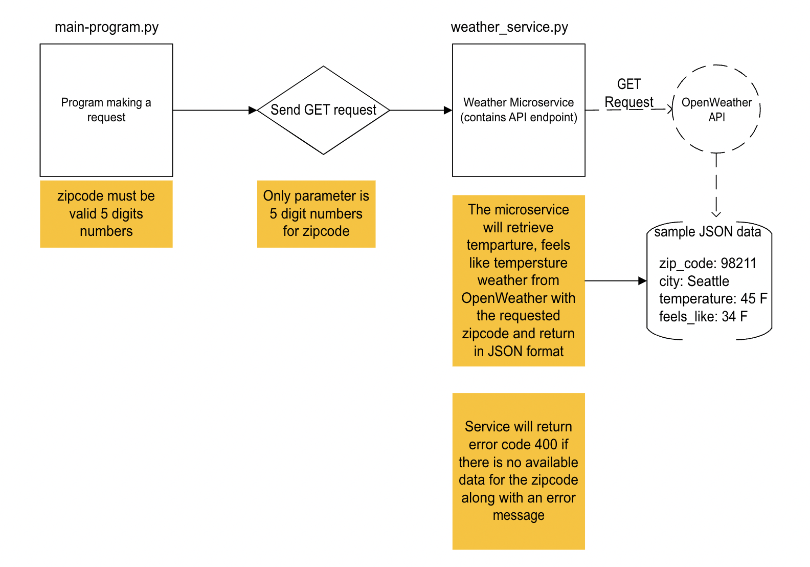

# Microservice Communication Contract

This document provides instructions on how to request and receive data from the Weather Report Microservice.

## 1. Requesting Data from the Microservice

To retrieve weather data, send an HTTP `GET` request to the microservice’s endpoint with a valid ZIP CODE as a query
parameter.

### Request Format

GET http://127.0.0.1:5000/weather?zip=<ZIP_CODE>

Replace `<ZIP_CODE>` with the desired ZIP code.

### **Port Usage**
- This microservice runs on port `5000` by default.
- Ensure your main program runs on a different port.

### API Key
This microservice requires an API key to fetch weather data from an external provider. You have two options:
1. Use your own API key: register your own API key at https://openweathermap.org/api
2. If needed, an API key can be shared privately.

### **Example Request (Python)**

import requests

url = "http://127.0.0.1:5000/weather?zip=98121"

response = requests.get(url)

if response.status_code == 200:
    data = response.json()
    print("Weather Data:", data)  
else:
    print(f"Error: {response.status_code} - {response.text}")

### **Example Response (JSON format)**

Once the GET request is sent and the weather_service.py is able to retrieve data, it will automatically return the data
back to the requester in JSON format

Example:

{
"zip": "98121",
"city": "Seattle",
"temperature": "43.79°F",
"feels_like": "41.7°F"
}
# cs361-MicroserviceA
